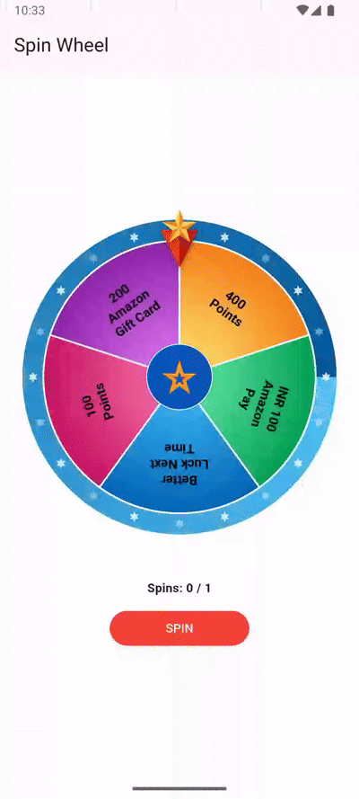
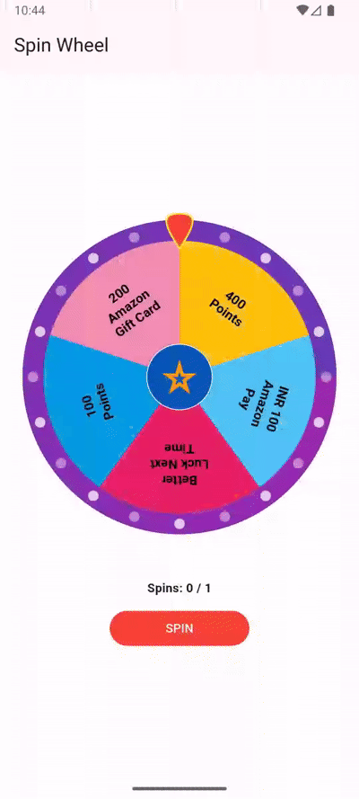

# Fortune Spin Wheel

<div align="center">
  
  
</div>

A reusable, highly customizable Flutter spin wheel for internal company apps.

Inspired by the supplied reward-wheel design, but built as a configurable package so each app can change:

- Number of segments
- Segment text/value
- Segment images or no images
- Segment colors
- Text style/alignment
- Wheel size
- Center button
- Marker/pointer design
- Outer ring
- Dividers
- Spin count / max spins
- Spin duration
- Winner animation
- Confetti
- Sound callbacks
- Custom winner overlay
- Custom callbacks
- Backend-selected winning index

## Important reward-system note

For real rewards, the backend should decide the winning item/index.
Do not rely on `Random()` in the Flutter UI for anything with monetary value.

The package accepts `targetIndex`, so your API can return the winner and the wheel can animate to that segment.

## Basic usage

```dart
final controller = SpinWheelController();

SpinWheel(
  controller: controller,
  items: [
    SpinItem(label: '400 Points'),
    SpinItem(label: '₹100 Gift Card'),
    SpinItem(label: '100 Points'),
    SpinItem(label: 'Better Luck Next Time'),
  ],
  onWinner: (item, index) {
    debugPrint('Winner: ${item.label}');
  },
);
```

Then:

```dart
controller.spin(targetIndex: 1);
```

## Image items

```dart
SpinItem(
  label: 'Amazon Gift Card',
  image: NetworkImage('https://example.com/amazon.png'),
)
```

## Maximum spins

```dart
SpinWheelController(maxSpins: 3);
```

`spin()` returns `false` when the allowed spin count has been exhausted.

## Sound

The package deliberately does not force an audio package on every host app.

Use callbacks:

```dart
SpinWheel(
  controller: controller,
  playSpinSound: () => audio.play(...),
  playWinSound: () => audio.play(...),
)
```

## Custom marker

```dart
SpinWheel(
  marker: const SpinWheelMarker(
    type: SpinMarkerType.star,
  ),
)
```

Available marker types:

- triangle
- arrow
- star
- pin
- custom

## Winner effect

```dart
SpinWheel(
  showConfetti: true,
  showWinnerOverlay: true,
  winnerOverlayBuilder: (context, item, index) {
    return MyWinnerDialog(item: item);
  },
)
```

## Package structure

```text
lib/
  fortune_spin_wheel.dart
  src/
    controller/
      spin_wheel_controller.dart
    models/
      spin_item.dart
    theme/
      spin_wheel_theme.dart
    widgets/
      spin_wheel.dart
      spin_wheel_marker.dart
      winner_overlay.dart
    painter/
      spin_wheel_painter.dart
```

## Developed By


**Siddharth Raj**
